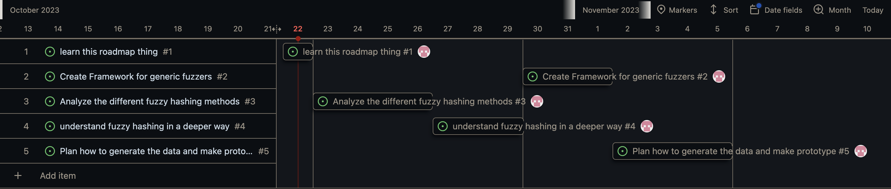

Bachelor Thesis (15 CP): A Study of Malware Detection Techniques for HPC Application Recognition
Start date: 18.10.2023
End date: 02.02.2024

# What I did

- Created a github repo with some code while playing around with machoc.
- Created an agile project in Github where my current plan will always be documented in a timeline and kanban board.
- Played around with some fuzzy hashers to get a feel of how this works with python

Current Roadmap for the next 2 weeks looks like this:

# What I will do

This week I will focus on analyzing the different fuzzy hashers and understanding on a deeper level.

While skimming some hashing algorithms I noticed that they are way harder to understand than I thought initialy. To leverage their potential I need to understand them.

# What else

I have made the repo public so that you can always follow my progress. I want to be as transparent as possible. Feel free to comment on tasks which you want to give me feedback. I always appreciate a second opinion.
